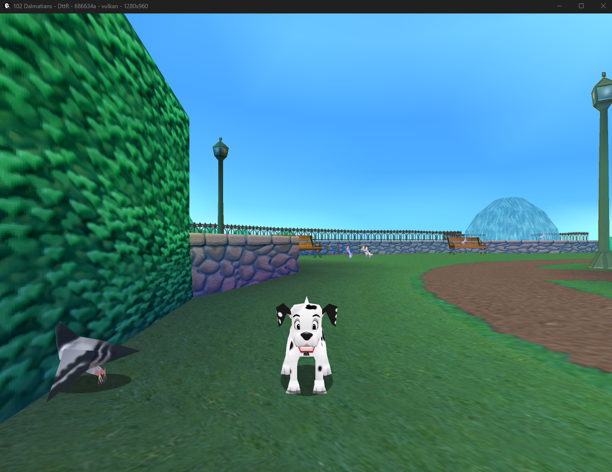

# 102 Patches: Detours to the Rescue


In this game you play as detours and you have to rescue 102 Dalmatians from the outdated dependencies and
incompatibilities made by the evil Microsoft de RectX7 (not joking)

{width=50% height=100px}

---

## Overview

An all-in-one alternate entrypoint that seeks to make 102 Dalmatians: Puppies to the Rescue as portable and consistent as possible, including:

* Support for modern graphics API (Direct3D12, Vulkan, Metal)
* Native controller support
* Stable support for windowed and fullscreen modes
* Various other fixes for crashes and undesired behavior

DttR implements purpose-built translators for the following outdated APIs:

* DirectDraw7 & Direct3D7 -> Direct3D12, Vulkan, Metal (backed by SDL3GPU)
    * Optionally uses a bunch of graphics-related optimizations and improvements
* DirectInput & WinAPI Inputs -> SDL3
* More to come probably

Because this project was created with the [102 Dalmatians Speedrunning Community](https://www.102.dog/) in mind,
it aims to modify as little of the original game logic as possible.

The generated internal documentation for this project can be found [here](https://dogstuff.gitlab.io/detours-to-the-rescue/).

**NOTE: This project currently only supports the English version of the game. Support for other languages will be added soon.**

---

## Getting started

1. Download the latest DttR build from the [release page](https://gitlab.com/dogstuff/detours-to-the-rescue/-/releases).
2. Place all files in the downloaded build archive next to `pcdogs.exe` in your game files. 
3. Run `dttr.exe`.
4. Profit.

The included `dttr.jsonc` configuration file can be edited to modify video settings, gamepad input, etc.

---

## Compilation

This project's build system relies on [Nix](https://github.com/NixOS/nix) for toolchain and dependency management.

(sorry windows users you can figure this out on your own)

### Nix Flake

```sh
nix develop
task build
# Output: build/dist/
```

This pulls in the cross-compiler, SDL3, VLC, NASM, and everything else automatically.

### Container Build

Build the project inside a container:

```sh
task container-build
# Output: build-container/dist/
```

---

## License

See [LICENSE](LICENSE) for details.
