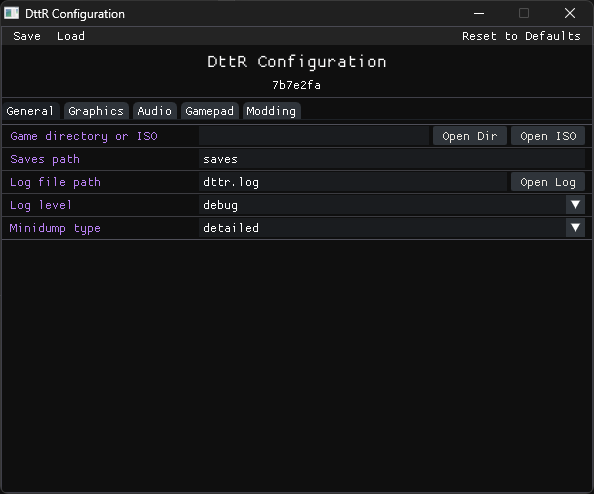

# Configuration

Run `dttr-config.exe` next to `dttr.exe` to change settings without hand-editing `dttr.json`.

Save your changes before closing the tool. DttR reads the saved `dttr.json` the next time it starts.

## General

### Game Directory or ISO

Use **Game directory or ISO** to switch discs, choose another installed copy, or fix a path after moving files.

### Saves Directory

By default, DttR reads and writes saves in `saves` next to `dttr.exe`. Each game executable variant gets its own subdirectory there.

Change it when:

- Windows cannot write to the DttR directory
- You want saves in a backed-up directory
- You want separate saves for testing or speedrunning

Set `saves_path` to an empty string in `dttr.json` if you want to disable save
redirection and let the game use its original paths.

### Intro Movies

Turn on **Skip intro movies** to skip the opening videos.

### Logs and Crash Reports

Use **Log file path** to move `dttr.log`. Relative paths resolve from the DttR directory.

Use **Log level** when troubleshooting. Release builds default to `info`; debug builds default to `debug`.

Use **Minidump type** to choose how much detail crash dumps include. Release builds default to `normal`; debug builds default to `detailed`.

## Graphics

### Scaling Method

Leave this on `logical` unless you're comparing renderers or debugging scaling.

- `logical` is the normal choice.
- `present` scales the final image instead. In `dttr.json`, use `present_scaling_algorithm` to choose nearest-neighbor or linear sampling.

### Scaling Fit

- `letterbox` keeps the correct aspect ratio and adds borders when needed.
- `stretch` fills the whole window, even when that distorts the image.
- `integer` scales in whole-number steps for sharper pixels.

Start with `letterbox` unless you want a different look.

### Vertex Precision

- `native` keeps the original-style vertex positioning.
- `subpixel` smooths polygon movement, though some models may show seams.

### Graphics API

Keep this on `auto` unless DttR has startup or rendering problems.

- `auto` lets DttR choose the best graphics API for the machine.
- `vulkan`, `direct3d12`, and `opengl` force a backend.

### Other Video Options

- `window_width` and `window_height` set the startup window size.
- `fullscreen` starts DttR fullscreen. You can also toggle fullscreen in game with ++f11++.
- `sprite_smooth` smooths scaled sprites. Turn it off for sharper pixels.
- `msaa_samples` smooths 3D edges at some performance cost. Use `1` to disable MSAA.
- `generate_texture_mipmaps` can make scaled textures look smoother.

Leave `texture_upload_sync` at its default unless you're debugging a renderer issue.

## Audio

### Audio Output

DttR routes the game's old Miles Sound System calls through SDL.

### Volume and Sample Tuning

- `mss_sample_gain` makes game audio louder or quieter. Use small changes because high values can clip.
- `mss_sample_preemphasis` changes how samples are filtered before playback. Leave it at the default unless you're comparing audio output on purpose.

## Gamepad

### Enable and Pick a Controller

Enable gamepad support, save, then start the game with the controller connected.

The controller index is SDL's gamepad number. Keep `0` for one controller. Change it only if DttR listens to the wrong device.

### Sticks and Axes

The default layout uses the left stick for movement and the right stick for the camera. Set an axis to `none` to disable it.

Change axis bindings when:

- Movement is on the wrong stick
- The camera moves on the wrong axis
- A trigger or unused stick should do nothing

### Deadzones

Raise a deadzone if a centered stick drifts. Lower it if movement or camera control feels unresponsive near the center.

Change values in small steps, save, then test in game.

### Buttons

Button mappings connect a physical controller button to a game action: directions, confirm, back, and start/pause.

To change a mapping, choose **Bind**, then press the controller button or trigger. If that button is already assigned to another action, the configuration tool swaps the old source into the other row.

Change one binding at a time, then test in game. Use **Reset** to restore the default mapping, or **Clear** to leave it unbound.

## Modding

The **Modding** tab is experimental.

- **Hot reload** reloads mod DLLs while DttR runs.
- The mod list shows DLLs in the `mods` directory. Uncheck a DLL to add it to
  `modding.disabled_mods` so DttR skips it on the next launch.

## Advanced Editing

For direct JSON editing, alternate config files, and the full key reference, see [Configuration (Technical)](technical/configuration.md).
