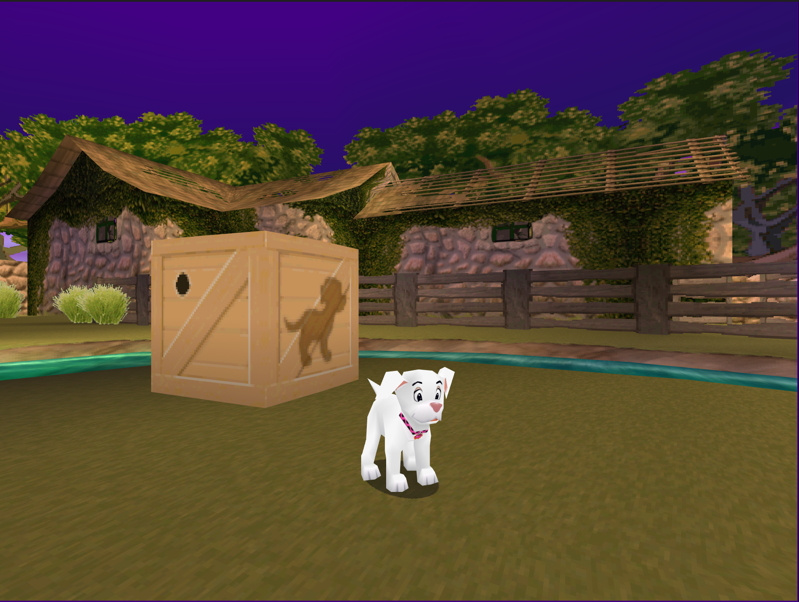

!!! example "Quick Start Guide"

    If this is your first time using DttR, the fastest way to get it running is by following the [quick start guide](quick-start/00-initial-setup.md).

# 102 Patches: Detours to the Rescue! (DttR)

DttR is a launcher and runtime for the PC version of *102 Dalmatians: Puppies to the Rescue* that lets the game run on modern systems and load user-created mods.

{ width="600" }

## What DttR Includes

By default, Detours to the Rescue includes:

- Replacements for all legacy game dependencies
- Native Direct3D 12, Vulkan, and OpenGL 3.3 support
- Modern windowed and fullscreen modes (no DxWnd/dgVoodoo needed!)
- Window-scoped/non-global keyboard inputs
- Configurable controller support
- Game fixes for audio, crashes, compatibility, and filesystem behavior
- An SDK and runtime for writing and running game mods

## Supported PC Releases

!!! info "Version Compatibility Note"

    If a version of the game is not listed below, it may still work, but it is not guaranteed to be stable.
    For compatibility requests or contributions, create an issue or merge request on this project's [GitLab repository](https://gitlab.com/dogstuff/detours-to-the-rescue).

The following releases of the game have been confirmed to be compatible with DttR:

- English
- French, German, Italian, Spanish, Dutch (European)
- Norwegian, Danish, Swedish (Scandinavian)

## License

MIT License

Copyright (c) 2026 Lentil

Permission is hereby granted, free of charge, to any person obtaining a copy
of this software and associated documentation files (the "Software"), to deal
in the Software without restriction, including without limitation the rights
to use, copy, modify, merge, publish, distribute, sublicense, and/or sell
copies of the Software, and to permit persons to whom the Software is
furnished to do so, subject to the following conditions:

The above copyright notice and this permission notice shall be included in all
copies or substantial portions of the Software.

THE SOFTWARE IS PROVIDED "AS IS", WITHOUT WARRANTY OF ANY KIND, EXPRESS OR
IMPLIED, INCLUDING BUT NOT LIMITED TO THE WARRANTIES OF MERCHANTABILITY,
FITNESS FOR A PARTICULAR PURPOSE AND NONINFRINGEMENT. IN NO EVENT SHALL THE
AUTHORS OR COPYRIGHT HOLDERS BE LIABLE FOR ANY CLAIM, DAMAGES OR OTHER
LIABILITY, WHETHER IN AN ACTION OF CONTRACT, TORT OR OTHERWISE, ARISING FROM,
OUT OF OR IN CONNECTION WITH THE SOFTWARE OR THE USE OR OTHER DEALINGS IN THE
SOFTWARE.
