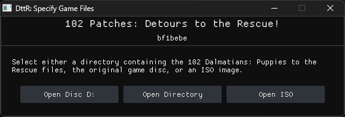
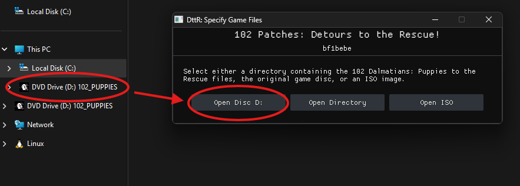
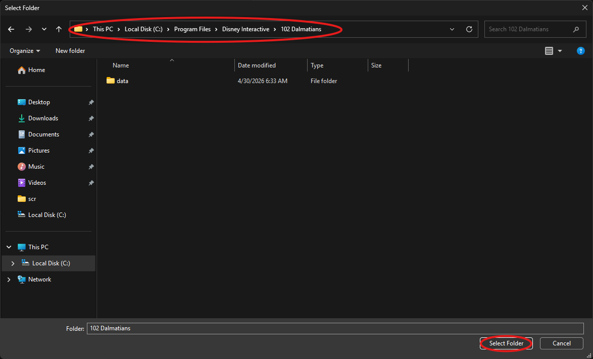
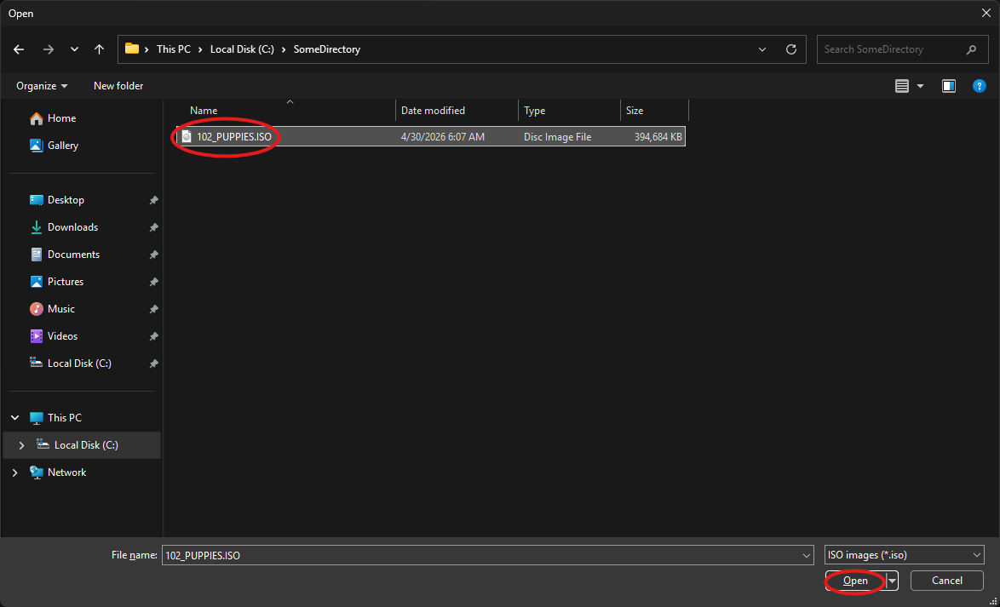
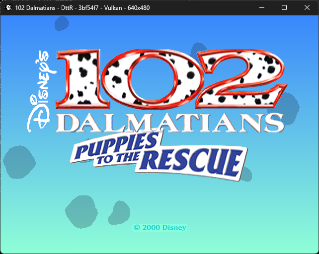

# Initial Setup

This guide gets DttR running with your original game files.

## Downloading DttR

1. Download the build of DttR you want to use:

    - [Vanilla](https://gitlab.com/dogstuff/detours-to-the-rescue/-/releases/permalink/latest/downloads/dttr-release.zip) - Does not load third-party mods. Use this build for speedruns.
    - [Modding](https://gitlab.com/dogstuff/detours-to-the-rescue/-/releases/permalink/latest/downloads/dttr-modding-release.zip) - Includes the DttR modding runtime and SDK.

2. Extract the archive to a writable directory.
3. Run `dttr.exe`.

## Loading the original game files

DttR should open a prompt asking for the original game files:

DttR can find the game files from a disc, an installed copy, or an ISO.
Choose the method that matches your setup.

=== "Original CD"

    !!! note ""

        The `Open Disc ...` buttons will only show if DttR detects an inserted/mounted disc containing the original game files.
        This includes official retail copies and mounted disc images.

    Insert the original *102 Dalmatians: Puppies to the Rescue* CD, then select the disc.

    

=== "Installed Copy"

    Choose `Open Directory` and select the installed game directory containing `pcdogs.exe`.

    

=== "ISO"

    Choose `Open ISO`, select the game ISO file, and click `Open`.

    

## You're done

Once DttR has the game files, setup is complete.

For controller mappings, graphics settings, and other options, see [Configuration](01-configuration.md).
