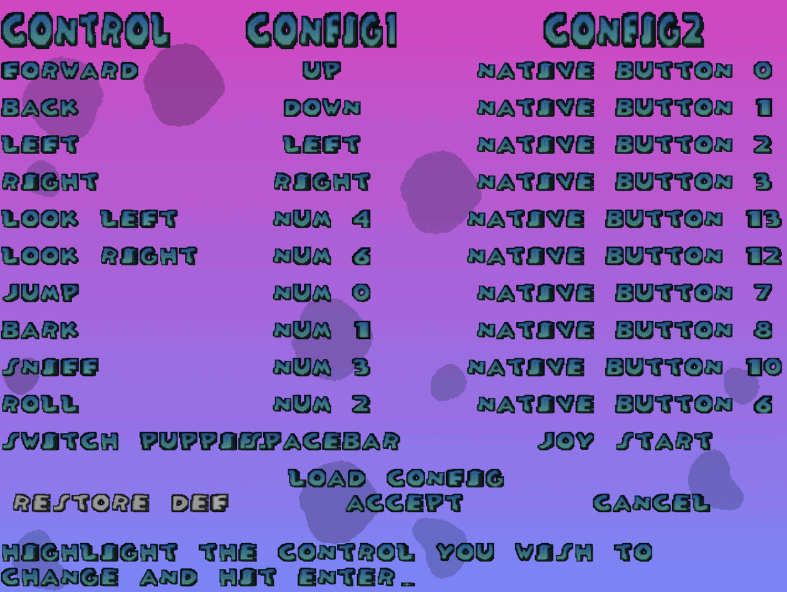

# Controls Setup

!!! note "Controller Menu Navigation Before Binding"

    Before controller buttons are bound, the controller cannot be used to navigate the game menus. Use the keyboard **Arrow keys**, **Esc**, and **Enter** until your controller buttons are assigned.

Most gameplay controls are still configurable from the game's own control menu.

DttR fixes a bunch of the issues with the original game's control bindings, including bug fixes and improved support for modern keyboards and controllers.

## Accessing the Controls Menu

The game's controls menu can be accessed from the title screen by pressing **Enter**, opening **Options**, and finally opening **Control**.

{ width="560" }

## Binding a Key or Button

To bind a button to a gameplay action, highlight the action you want to rebind and press **Enter**. Then press the keyboard key or controller button you want to use.

DttR adds the ability to bind keyboard keys and controller buttons to any slot, regardless of which column it's under.  

For more details for setting up controllers, see [Controller Setup](using-a-controller.md).
