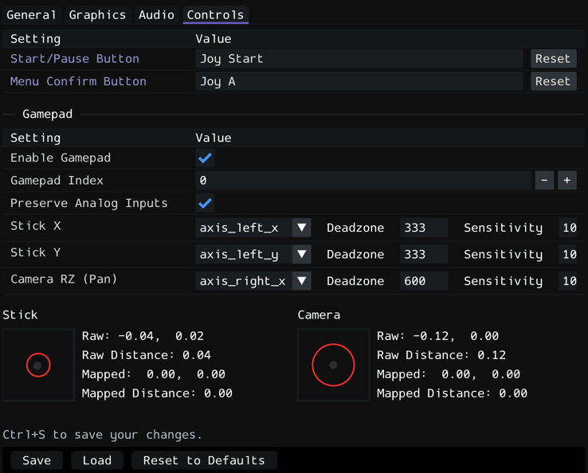

# Using a Controller/Gamepad

DttR supports modern controllers natively but you may need to tweak a few settings to .

To tweak your controller settings, connect your controller before opening the configuration menu, ensure `Enable Gamepad` is checked, then click save. 

If you have multiple controllers plugged in on your machine at the same time, you may need to set the value of the `Gamepad Index` field to the number/index used by your controller. In most cases this value can be left at `0`, but if your controller inputs aren't registering, you can figure out the index fairly easily by repeatedly incrementing the value by one and attempting to bind your button until it works.

{ width="560" }

## Analog Stick Input

DttR corrects the PC version's broken analog stick mapping, making analog movement match the PSX version of the game.

To ensure your analog sticks are mapped correctly, move the sticks around and ensure the preview align with your inputs.

If your analog stick movements aren't registering or aren't showing on the correct stick or axis, play around with the values of the `axis_...` dropdowns for Stick X, Stick Y, and Camera RZ.

## Special Bindings

Some in game actions, including Start/Pause and Menu Confirm, originally had their button bindings hard-coded in the original game, meaning they can't be bound from the in-game controls menu. 
Because this often breaks compatibility with modern controllers, DttR adds for rebinding these buttons through the settings menu.

To rebind them, open the `Controls` tab in the settings menu, click on the value box in the row of the button you want to bind, and then press the button on your controller (or keyboard) that you want to bind it to.
